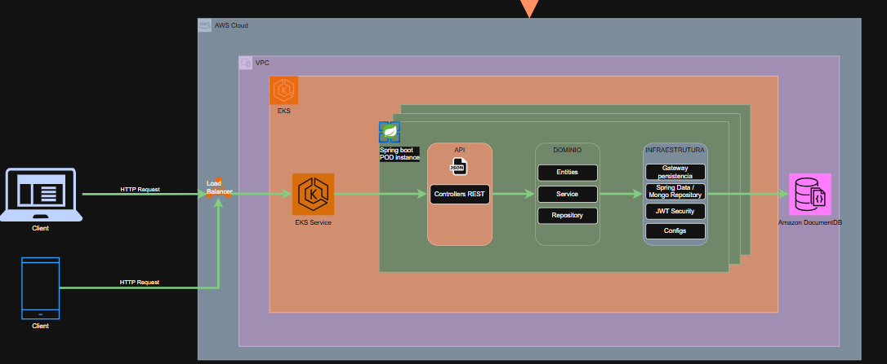
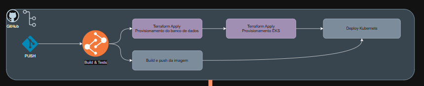

# 🛠️ Officyna - Sistema Integrado de Gestão de Oficina Mecânica
Este projeto representa o MVP (Produto Mínimo Viável) desenvolvido para o Tech Challenge da Fase 1. A solução visa digitalizar a jornada de atendimento de uma oficina mecânica, substituindo processos manuais por um fluxo automatizado e seguro.

## 📋 Sumário

* [Objetivo do Projeto](#objetivo-do-projeto)
* [Funcionalidades Implementadas](#funcionalidades-implementadas)
* [Arquitetura Técnica](#arquitetura-técnica)
* [Segurança e Qualidade](#segurança-e-qualidade)
* [Instruções de Execução](#instruções-de-execução)

# 🎯 Objetivo do Projeto
O projeto `Officyna` é um sistema integrado de gestão para oficinas mecânicas de automóveis que visa:
* Digitalizar o atendimento;
* Substitur processos manuais por fluxos automatizados e seguros;

Nesta segunda fase, os objetivos principais são modernizar a infraestrutura e a arquitetura do software, garantindo que o sistema seja escalável, resiliente e siga as melhores práticas de mercado
Para isso, o foco está na implementação da Clean Architecture para organizar a lógica de negócio, na Dockerização para empacotamento em containers, e no uso de Kubernetes para orquestração em nuvem
Além disso, a fase foca na automação total via Infraestrutura como Código (IaC) com Terraform e pipelines de CI/CD para garantir agilidade e confiabilidade na entrega do software

## ✨ Funcionalidades Implementadas
### 1. Gestão de Ordens de Serviço (OS)
   Abertura de OS: Identificação por CPF/CNPJ e cadastro detalhado do veículo.

- Orçamento Automático: Cálculo automático de valores baseado em serviços (labors) e peças (supplies) adicionados.

- Status da OS: Ciclo de vida completo com os status: Recebida, Em diagnóstico, Aguardando aprovação, Em execução, Finalizada e Entregue.

- Acompanhamento via API: Endpoint dedicado para consulta do cliente através do documento (CPF/CNPJ).

### 2. Gestão Administrativa (CRUDs)
   O sistema provê interfaces REST para o gerenciamento de:

- Clientes: Cadastro completo com validação de documentos.

- Veículos: Vínculo com clientes e validação de placas.

- Serviços: Listagem de mão de obra disponível.

- Peças e Insumos: Controle de inventário com alerta de estoque baixo.

### 3. Monitoramento
   Tempo Médio de Execução: Serviço especializado que calcula e monitora a performance da oficina por tipo de serviço.

# 🏗️ Arquitetura Técnica


## Componentes da Aplicação
A aplicação é construída como um back-end monolítico organizado seguindo os princípios da Clean Architecture, dividindo-se em camadas de API, Domínio (DDD) e Infraestrutura .

```bash
officyna-service/
├officyna-service/ # Raiz do microsserviço
├── .github/
│   └── workflows/ # Pipelines de CI/CD
├── db-seed/ # Scripts para popular o banco de dados inicial
├── k8s/ # Manifestos de orquestração do Kubernetes (aplicação + Kong)
└── src/
    ├── main/
    │   ├── java/
    │   │   └── br/
    │   │       └── com/
    │   │           └── officyna/
    │   │               ├── administrative/ # Módulo Administrativo (Bounded Context / Vertical Slice)
    │   │               │   ├── customer/ # Agregado/Subdomínio de Cliente
    │   │               │   │   ├── api/ # Camada de Entrada/Apresentação (Primary Adapters)
    │   │               │   │   │   ├── controller/ # Endpoints REST
    │   │               │   │   │   ├── handler/ # Tratamento de eventos/exceções da API
    │   │               │   │   │   └── resources/ # Payloads, DTOs de Request/Response
    │   │               │   │   └── domain/ # Núcleo da Regra de Negócio (Core / Domain Layer)
    │   │               │   │       ├── controller/ # Interfaces/Ports de entrada (Casos de Uso)
    │   │               │   │       ├── entity/ # Entidades de Domínio
    │   │               │   │       ├── exception/ # Exceções específicas de negócio
    │   │               │   │       ├── mapper/ # Conversores entre DTOs e Entidades
    │   │               │   │       ├── presenter/ # Formatação de dados de saída
    │   │               │   │       ├── repository/ # Interfaces/Ports de saída para persistência
    │   │               │   │       ├── service/ # Serviços de Domínio / Implementação de Casos de Uso
    │   │               │   │       └── validation/ # Regras de validação de negócio
    │   │               │   ├── labor/ # Agregado/Subdomínio de Mão de Obra
    │   │               │   │   ├── api/
    │   │               │   │   │   ├── controller/
    │   │               │   │   │   ├── handler/
    │   │               │   │   │   └── resources/
    │   │               │   │   └── domain/
    │   │               │   │       ├── controller/
    │   │               │   │       ├── entity/
    │   │               │   │       ├── exception/
    │   │               │   │       ├── mapper/
    │   │               │   │       ├── presenter/
    │   │               │   │       ├── repository/
    │   │               │   │       └── service/
    │   │               │   ├── supply/ # Agregado/Subdomínio de Suprimentos
    │   │               │   │   ├── api/
    │   │               │   │   │   ├── controller/
    │   │               │   │   │   ├── handler/
    │   │               │   │   │   └── resources/
    │   │               │   │   └── domain/
    │   │               │   │       ├── controller/
    │   │               │   │       ├── entity/
    │   │               │   │       ├── exception/
    │   │               │   │       ├── mapper/
    │   │               │   │       ├── presenter/
    │   │               │   │       ├── repository/
    │   │               │   │       └── service/
    │   │               │   ├── user/ # Agregado/Subdomínio de Usuários
    │   │               │   │   ├── api/
    │   │               │   │   │   ├── controller/
    │   │               │   │   │   ├── handler/
    │   │               │   │   │   └── resources/
    │   │               │   │   └── domain/
    │   │               │   │       ├── controller/
    │   │               │   │       ├── entity/
    │   │               │   │       ├── exception/
    │   │               │   │       ├── mapper/
    │   │               │   │       ├── presenter/
    │   │               │   │       ├── repository/
    │   │               │   │       └── service/
    │   │               │   └── vehicle/ # Agregado/Subdomínio de Veículos
    │   │               │       ├── api/
    │   │               │       │   ├── controller/
    │   │               │       │   ├── handler/
    │   │               │       │   └── resources/
    │   │               │       └── domain/
    │   │               │           ├── controller/
    │   │               │           ├── entity/
    │   │               │           ├── exception/
    │   │               │           ├── mapper/
    │   │               │           ├── presenter/
    │   │               │           ├── repository/
    │   │               │           └── service/
    │   │               ├── infrastructure/ # Camada de Infraestrutura Transversal (Secondary Adapters / Frameworks)
    │   │               │   ├── auth/ # Implementações de Autenticação
    │   │               │   ├── config/ # Configurações gerais do Spring Boot (Beans, etc.)
    │   │               │   ├── converter/ # Conversores globais da aplicação
    │   │               │   ├── exception/ # Tratamento de exceções globais da infra
    │   │               │   ├── persistence/ # Implementações dos Repositories do Domínio
    │   │               │   │   ├── component/ # Componentes utilitários de banco
    │   │               │   │   ├── config/ # Configuração do banco de dados
    │   │               │   ├── mapper/ # Conversores Infra <-> Domínio
    │   │               │   └── mongodb/ # Adaptador específico do MongoDB
    │   │               │       ├── gateway/ # Implementação concreta das interfaces do domínio
    │   │               │       ├── model/ # Documentos/Entidades do MongoDB (@Document)
    │   │               │       └── repository/ # Interfaces do Spring Data MongoDB
    │   │               │   └── security/ # Configurações de Segurança (Spring Security)
    │   │               ├── inventory/ # Módulo de Estoque
    │   │               │   ├── api/
    │   │               │   │   ├── controller/
    │   │               │   │   └── resources/
    │   │               │   ├── domain/
    │   │               │   │   ├── mapper/
    │   │               │   │   └── service/
    │   │               │   └── repository/ # Repositório fora da infra transversal (Abordagem mais acoplada neste módulo)
    │   │               ├── monitoring/ # Módulo de Monitoramento / Telemetria
    │   │               │   ├── api/
    │   │               │   │   ├── controller/
    │   │               │   │   └── resources/
    │   │               │   └── domain/
    │   │               │       ├── controller/
    │   │               │       ├── entity/
    │   │               │       ├── presenter/
    │   │               │       ├── repository/
    │   │               │       └── service/
    │   │               ├── seed/ # Modulo para cadastrar dados básicos durante o deploy
    │   │               └── serviceorder/ # Módulo de Ordem de Serviço
    │   │                   ├── api/
    │   │                   │   ├── controller/
    │   │                   │   ├── handler/
    │   │                   │   └── resources/
    │   │                   └── domain/
    │   │                       ├── controller/
    │   │                       ├── dto/ # Transferência de dados interna do domínio
    │   │                       ├── entity/
    │   │                       ├── enums/ # Enumerações de negócio (ex: Status da OS)
    │   │                       ├── exception/
    │   │                       ├── mapper/
    │   │                       ├── presenter/
    │   │                       ├── repository/
    │   │                       └── service/
    │   └── resources/ # Arquivos de configuração (application.yml), properties e recursos estáticos
    └── test/ # Diretório base para testes (Unitários, Integração, Arquitetura)
````

### Camada de Domínio: 
Contém as entidades puras (como Customer e ServiceOrder) e as interfaces de repositório, isolando as regras de negócio de detalhes técnicos.

### Camada de Aplicação/Casos de Uso: 
Implementa as funcionalidades do software, como a abertura e o cálculo de orçamentos de ordens de serviço.

### Camada de Adaptadores (Interface Adapters): 
Inclui os controllers REST, DTOs e Gateways que traduzem dados entre o mundo exterior e o núcleo da aplicação.

### Camada de Infraestrutura: 
Lida com frameworks e drivers, como as configurações do Spring Boot e a persistência real no MongoDB.

### Infraestrutura Provisionada
A infraestrutura de nuvem foi segregada em repositórios próprios com Terraform e CI/CD dedicados, conforme os requisitos do Tech Challenge:
* [officyna-infra-db](https://github.com/Officyna/officyna-infra-db) — VPC, subnets e o cluster Amazon DocumentDB (compatível com MongoDB).
* [officyna-infra-k8s](https://github.com/Officyna/officyna-infra-k8s) — cluster Amazon EKS e node group, usando a VPC/subnets publicadas pelo repositório do banco via AWS Systems Manager Parameter Store.
* **Persistência:** Uso de volumes EBS (Elastic Block Store) via Persistent Volume Claims (PVC) para garantir que os dados das ordens de serviço sobrevivam a reinicializações de containers.

Este repositório (`officyna-service`) não contém mais Terraform — apenas os manifestos Kubernetes (`k8s/`) da aplicação e do Kong (API Gateway), aplicados via `kubectl` no próprio pipeline.

## Fluxo de Deploy
O fluxo de implantação é totalmente automatizado via GitHub Actions:
* **Integração Contínua (CI):** Ao realizar um push, o pipeline executa o checkout do código, build com Maven e testes automatizados para garantir a qualidade.
* **Dockerização:** Após os testes, uma nova imagem Docker é gerada e enviada para o GitHub Container Registry (GHCR).
* **Pré-requisito de infraestrutura:** o cluster EKS (`officyna-infra-k8s`) e o DocumentDB (`officyna-infra-db`) precisam já estar no ar — o endpoint do banco é lido em tempo de deploy via AWS Systems Manager Parameter Store (`/officyna/db/endpoint`), publicado pelo pipeline do `officyna-infra-db`.
* **Entrega Contínua (CD):** Os manifestos Kubernetes (aplicação + Kong) são aplicados no cluster EKS para atualizar a aplicação sem interrupção (Rolling Update).

### Ordem para destruir a infraestrutura (evitar custo na AWS)
Como cada camada agora vive em um repositório com estado Terraform próprio, a ordem de destruição importa (o EKS depende da VPC/subnets criadas pelo DocumentDB):
1. **officyna-service** → workflow `Destroy Infrastructure (manual)`: remove a aplicação e o Kong do cluster (`kubectl delete`).
2. **officyna-infra-k8s** → workflow manual `action: destroy`: destrói o cluster EKS.
3. **officyna-infra-db** → workflow manual `action: destroy`: destrói o DocumentDB e a VPC/subnets.

## 🛡️ Segurança e Qualidade
- Autenticação JWT: Implementada para proteger todos os endpoints administrativos.

- Validação de Dados: Classes utilitárias para validação rigorosa de CPF, CNPJ (Modulo 11) e placas de veículos.

- Testes Automatizados: O projeto exige cobertura mínima de 80% nos domínios críticos (OS, Orçamentos, Estoque e Segurança).

# 🚀 Instruções de Execução
## local
O projeto está configurado para uma execução local simples via Docker.
- Build da Aplicação: O Dockerfile deve ser utilizado para gerar a imagem da aplicação.
- Orquestração: O arquivo docker-compose.yml sobe a aplicação e a instância do MongoDB.
- Comando de inicialização:

````bash
docker-compose up -d --build
````

## Acesso à Documentação
* Após subir o ambiente local, acesse o Swagger em: http://localhost:8080/swagger-ui.html
* Após realziar o deploy no kubernets: <https://{dns-elb}.us-east-1.elb.amazonaws.com/swagger-ui/index.html>

## Deploy em Kubernetes

A implantação no cluster utiliza manifestos YAML localizados na pasta `/k8s`:
* **Aplicação:** Implante os pods e a estratégia de replicação com kubectl 
````bash 
kubectl apply -f deployment.yaml
````
* **Configurações:** Aplique as variáveis de ambiente e segredos com 
````bash 
kubectl apply -f configmap.yaml
````
* **Exposição:** Exponha a API internamente ou via Load Balancer com 
````bash 
kubectl apply -f service.yaml
````
* **Escalabilidade:** Ative o escalonamento automático baseado em uso de CPU/Memória com
````bash 
kubectl apply -f hpa.yaml
````

## Provisionamento da Infraestrutura com Terraform
A rede, o banco de dados e o cluster EKS são provisionados via Terraform nos repositórios dedicados — veja as instruções de `terraform init/plan/apply` em cada um:
- [officyna-infra-db](https://github.com/Officyna/officyna-infra-db) — VPC, subnets e DocumentDB.
- [officyna-infra-k8s](https://github.com/Officyna/officyna-infra-k8s) — cluster EKS e node group.

Após o provisionamento, conecte seu `kubectl` ao cluster na nuvem:
````bash
aws eks update-kubeconfig --name eks-officyna-service --region us-east-1
````